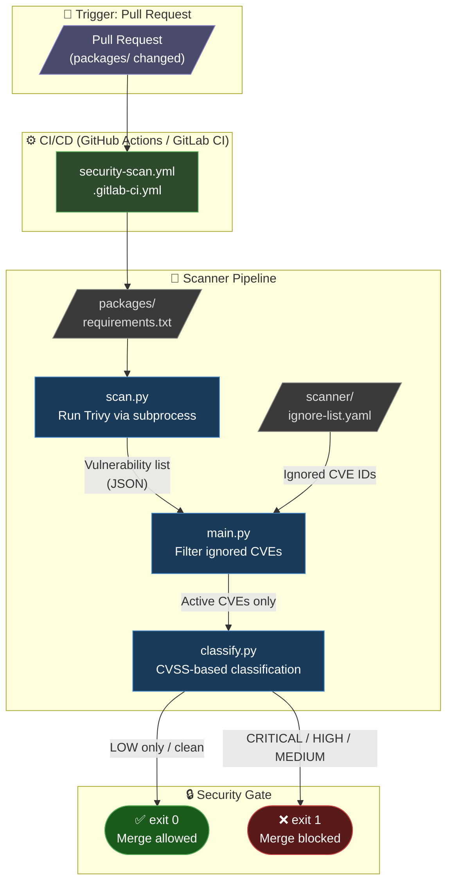
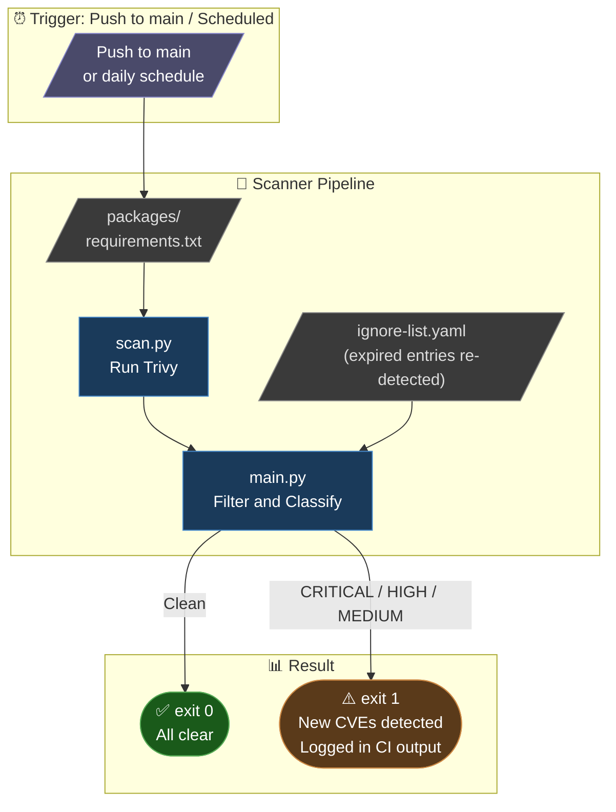
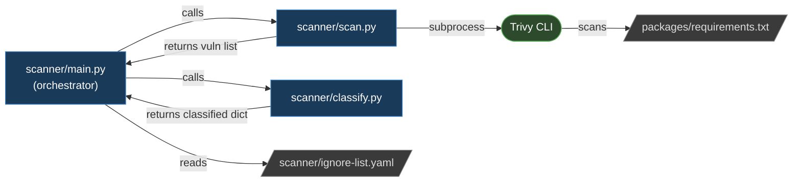
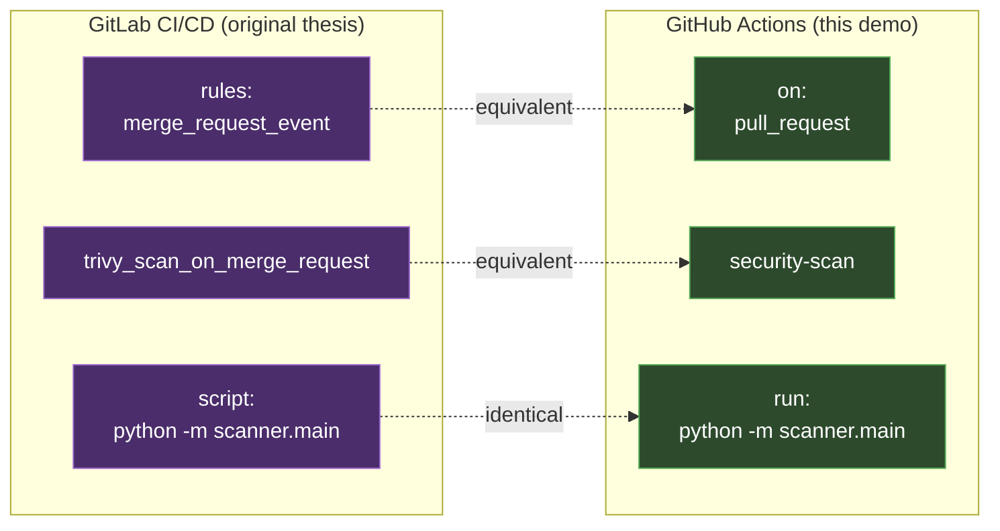

# Architecture

This document describes the pipeline design of the Python Package Security Pipeline,
covering both Process 1 (MR-triggered Security Gate) and
Process 2 (scheduled CVE lifecycle scan).

Both processes are based on the security concept designed in the Bachelor thesis,
implemented originally in GitLab CI/CD and ported to GitHub Actions for this public demo.

---

## Components

| File | Role |
|------|------|
| `packages/requirements.txt` | Input: Python dependency list to be scanned |
| `scanner/scan.py` | Runs Trivy via subprocess; parses JSON output |
| `scanner/classify.py` | Groups CVEs by CVSS severity; evaluates Security Gate |
| `scanner/ignore-list.yaml` | Configuration: CVEs accepted as known risk (with expiry) |
| `scanner/main.py` | Orchestrator: coordinates scan → filter → classify → report |
| `.github/workflows/security-scan.yml` | CI/CD automation (GitHub Actions) |
| `.gitlab-ci.yml` | Reference: original GitLab CI/CD design (not executable here) |

---

## Process 1: Package Request and Approval (MR-triggered)

Triggered automatically when a Pull Request modifies `packages/requirements.txt`
or any file under `scanner/`.
The pipeline acts as a **Security Gate**: the merge is blocked if any
MEDIUM, HIGH, or CRITICAL vulnerability is found in the active CVE list.

### Security Gate threshold

| Severity | CVSS Score | Gate result |
|----------|-----------|-------------|
| CRITICAL | ≥ 9.0 | ❌ Blocked |
| HIGH | 7.0 – 8.9 | ❌ Blocked |
| MEDIUM | 4.0 – 6.9 | ❌ Blocked |
| LOW | 0.1 – 3.9 | ✅ Allowed |
| None | — | ✅ Allowed |

---

## Process 2: CVE Lifecycle Management (scheduled)

Triggered on every push to `main` and optionally on a daily schedule.
Monitors the **current state** of all packages after each merge.
Expired entries in `ignore-list.yaml` are automatically re-detected,
ensuring that accepted risks are revisited before their deadline.

---

## Module dependency

---

## GitLab CI/CD vs GitHub Actions

The same pipeline logic is expressed in both CI/CD systems.

